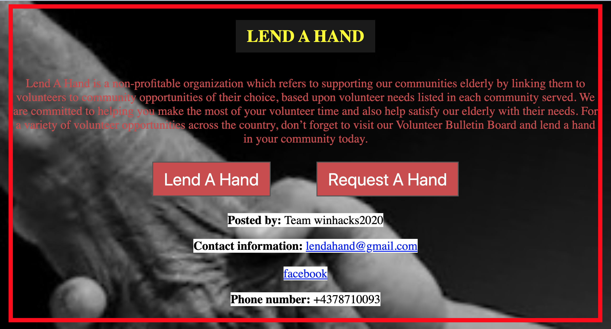

# Winhacks-2020

<h2>Overview</h2>
LendAHand is our submission for Winhacks 2020. This mobile app was created by myself, Tony Alas, Niaz-Ul-Haque Haque and Zarif Hasan. The theme of this hackathon was mobility was we decided to make a web application that helped those who are elderly, injured, or sick gain some mobility.

<h2>Home Page</h2>
Niaz-Ul-Haque Haque and Zarif Hasan took the lead on the user-side front-end development for our app and designed that look and feel of the website. Here is the design that the users are greeted with when they first open the homepage.




<h2>User Authentication</h2>
The backend was handled mainly by myself and Tony Alas. We utilized Google Firebase to authorize users who are using the website. Once the user fills out all the required fields correctly on the signup page and clicks the signup button, this function is run in a seperate javascript file that connects with an online database to store the information.


```
function createUserSignUpEmail() {
    
    // Get all user fields
    var full_name = document.getElementById("fullName").value;
    var myUsername = document.getElementById("userName").value
    var email = document.getElementById("emailFieldSignUp").value;
    var password = document.getElementById("passFieldSignUp").value;
    var passwordRe_enter = document.getElementById("passFieldSignUp").value;

    //make sure they didn't leave anything blank
    if ( full_name == "" || myUsername == "" || email == "" || password == "" || passwordRe_enter == "") {
        window.alert("Please fill out all forms");
    }else {
        var db = firebase.firestore();

        firebase.auth().createUserWithEmailAndPassword(email, password).catch(function(error) {
            // Handle Errors here.
            var errorCode = error.code;
            var errorMessage = error.message;
    
            //display error message if something went wrong.
            window.alert("Error " + errorMessage);
            // ...
          }).then(cred => {
          //Add User details to firebase
          return db.collection("users").doc(cred.user.uid).set({
            name: full_name,
            username: myUsername
          });
        });
    }
}
```
